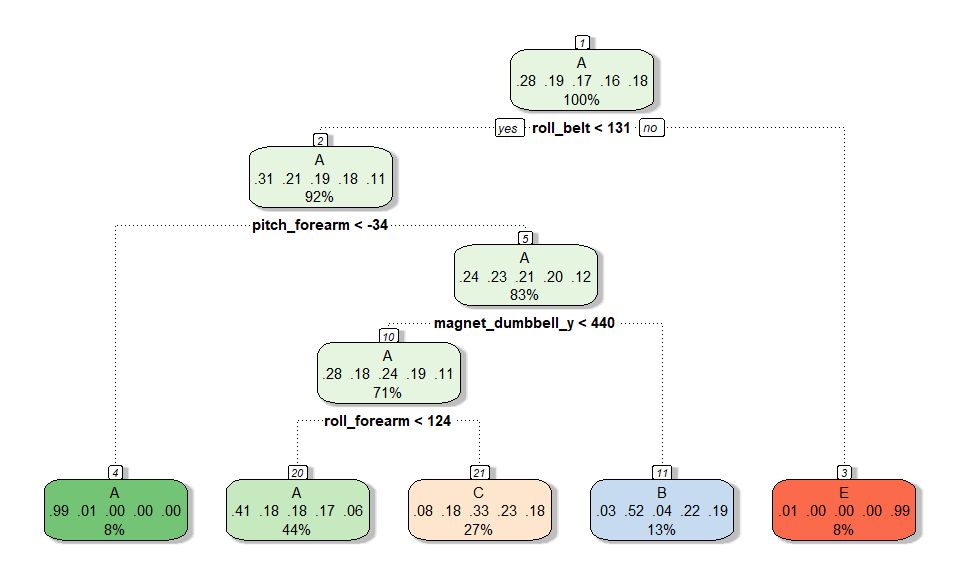
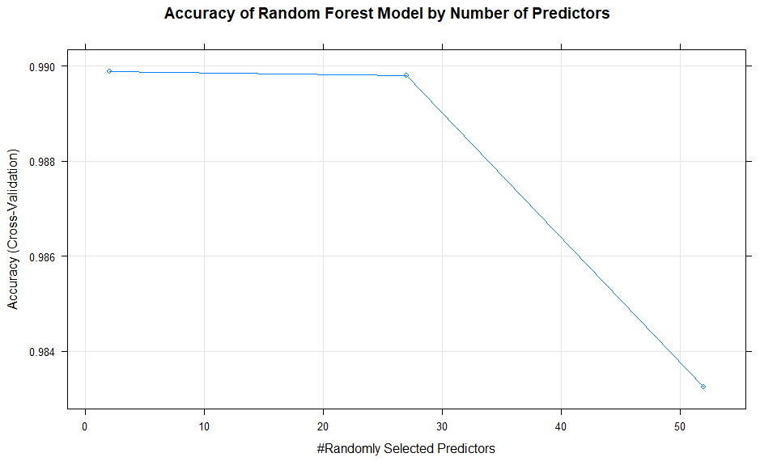
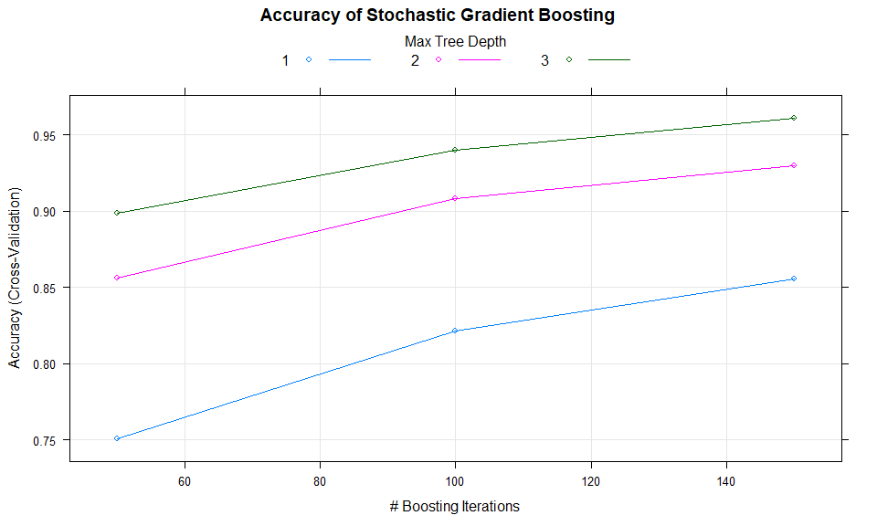

***

# Background

Using devices such as Jawbone Up, Nike FuelBand, and Fitbit it is now possible to collect a large amount of data about personal activity relatively inexpensively. These type of devices are part of the quantified self movement – a group of enthusiasts who take measurements about themselves regularly to improve their health, to find patterns in their behavior, or because they are tech geeks. One thing that people regularly do is quantify how much of a particular activity they do, but they rarely quantify how well they do it. In this project, your goal will be to use data from accelerometers on the belt, forearm, arm, and dumbell of 6 participants. They were asked to perform barbell lifts correctly and incorrectly in 5 different ways. More information is available from the website here: <http://web.archive.org/web/20161224072740/http:/groupware.les.inf.puc-rio.br/har> (see the section on the Weight Lifting Exercise Dataset).

***

# Data

The training data for this project are available here: <https://d396qusza40orc.cloudfront.net/predmachlearn/pml-training.csv>

The test data are available here: <https://d396qusza40orc.cloudfront.net/predmachlearn/pml-testing.csv>

The data for this project come from this source: <http://groupware.les.inf.puc-rio.br/har>. 

***

# Goal

The goal of this project is to predict the manner in which they did their exercises. This is the "classe" variable in the training set. I may use any of the other variables to predict with. I should create a report describing how I built my model, how I used cross validation, what I think the expected out of sample error is, and why I made the choices I did. I will also use my prediction model to predict 20 different test cases.

***

# Methodology

Prediction evaluations will be based on maximizing the accuracy and minimizing the out-of-sample error. Decision tree, random forest, gradient boosting algorithms will be used. The algorithm with the highest accuracy will be chosen as our final model. Cross-validation will be performed by sub-sampling our `train_data` data set randomly without replacement into 2 subsamples: `train` (70% of the original training data set) and `valid` (30%). Our models will be fitted on the `train` dataset, and tested on the `valid` dataset. Once the most accurate model is choosen, it will be tested on the original `test_data` data set.

***

# Expected out-of-sample error

The expected out-of-sample error will correspond to the quantity: 1-accuracy in the cross-validation data. Accuracy is the proportion of correct classified observation over the total sample in the `valid` data set. Expected accuracy is the expected accuracy in the out-of-sample data set (i.e. original testing data set). Thus, the expected value of the out-of-sample error will correspond to the expected number of missclassified observations/total observations in the Test data set, which is the quantity: 1-accuracy found from the cross-validation data set.

***

## Set seed, load libraries, and load data

```r
set.seed(12345)

# load the required packages
suppressWarnings(suppressMessages(library(lattice)))
suppressWarnings(suppressMessages(library(ggplot2)))
suppressWarnings(suppressMessages(library(caret)))
suppressWarnings(suppressMessages(library(rattle)))
suppressWarnings(suppressMessages(library(rpart)))
suppressWarnings(suppressMessages(library(rpart.plot)))
suppressWarnings(suppressMessages(library(randomForest)))
suppressWarnings(suppressMessages(library(repmis)))
suppressWarnings(suppressMessages(library(ElemStatLearn)))

# import the data from the URLs
# train_url <- "http://d396qusza40orc.cloudfront.net/predmachlearn/pml-training.csv"
# test_url  <- "http://d396qusza40orc.cloudfront.net/predmachlearn/pml-testing.csv"
# training <- read.csv(url(train_url), na.strings = c("NA","#DIV/0!",""))
# testing  <- read.csv(url(test_url),  na.strings = c("NA","#DIV/0!",""))
# write.csv(training, file = "pml-training.csv",row.names=FALSE)
# write.csv(testing,  file = "pml-testing.csv", row.names=FALSE)

# I'm normally behind I firewall so I load data locally
train_data <- read.csv("pml-training.csv", na.strings = c("NA", ""))
test_data <- read.csv("pml-testing.csv", na.strings = c("NA", ""))
```

The `train_data` dataset has 19,622 observations with 160 variables and the `test_data` dataset contains 20 observations also with 160 variables.  I am trying to predict the outcome of the variable `classe` in the testing set.

***

## Data cleaning

We now delete columns (predictors) of the training set that contain any missing values.


```r
train_data <- train_data[, colSums(is.na(train_data)) == 0]
test_data <- test_data[, colSums(is.na(test_data)) == 0]
```

We also remove the first seven predictors since these variables have little predicting power for the outcome `classe`.


```r
train_data <- train_data[, -c(1:7)]
test_data <- test_data[, -c(1:7)]
```

The cleaned data sets train_data and test_data both have 53 columns with the same first 52 variables and the last variable classe and problem_id individually. train_data has 19622 rows while test_data has 20 rows.

***

## Data splitting

In order to get out-of-sample errors, we split the cleaned `train_data` set into a training set (`train`, 70%) for prediction and a validation set (`valid`, 30%) to compute the out-of-sample errors.


```r
inTrain <- createDataPartition(y=train_data$classe, p=0.7, list=FALSE)
train <- train_data[inTrain,] 
valid  <- train_data[-inTrain,]
```

After splitting `train_data`, the `train` dataset has 13737 records and the `valid` dataset has 5885 records.

***

## Prediction models

In the following sections, I will test three different models: 

 * Classification Tree Method
 * Random Forest Method
 * Gradient Boosting Method
 
In order to limit the effects of overfitting, and improve the efficicency of the models, I will use the cross-validation technique. I will use five folds (usually, five or ten can be used, but ten folds gives higher run times with no significant increase of the accuracy).

***

### Classification Tree (rpart) Model


```r
mod1 <- train(classe ~., method = "rpart", data = train, 
              trControl = trainControl(method = "cv", number = 5))

print(mod1, digits = 4)
```

```
## CART 
## 
## 13737 samples
##    52 predictor
##     5 classes: 'A', 'B', 'C', 'D', 'E' 
## 
## No pre-processing
## Resampling: Cross-Validated (5 fold) 
## Summary of sample sizes: 10987, 10990, 10990, 10991, 10990 
## Resampling results across tuning parameters:
## 
##   cp       Accuracy  Kappa  
##   0.03458  0.5270    0.39102
##   0.06093  0.3911    0.16700
##   0.11596  0.3327    0.07359
## 
## Accuracy was used to select the optimal model using the largest value.
## The final value used for the model was cp = 0.03458.
```
### Classification Tree Fancy Plot
<!-- -->

### Classification Tree Prediction and Accuracy
Predict on the validation data

```r
pred1 <- predict(mod1,valid) 
```
Show prediction result confusion matrix for the classification tree model

```r
conf_mod1 <- confusionMatrix(valid$classe, pred1)
conf_mod1$table
```

```
##           Reference
## Prediction    A    B    C    D    E
##          A 1525   29  116    0    4
##          B  484  385  270    0    0
##          C  499   37  490    0    0
##          D  423  187  354    0    0
##          E  153  159  289    0  481
```
As you can see from the confusion matrix, this model is not very accurate


```r
accuracy_mod1 <- conf_mod1$overall[1]
```
In fact, it is only **48.95%** accurate.

***

## Random Forest Model

```r
mod2 <- train(classe ~., method = "rf",  data=train, 
              trControl = trainControl(method = "cv", number = 5))

print(mod2, digits = 4)
```

```
## Random Forest 
## 
## 13737 samples
##    52 predictor
##     5 classes: 'A', 'B', 'C', 'D', 'E' 
## 
## No pre-processing
## Resampling: Cross-Validated (5 fold) 
## Summary of sample sizes: 10990, 10989, 10990, 10990, 10989 
## Resampling results across tuning parameters:
## 
##   mtry  Accuracy  Kappa 
##    2    0.9899    0.9872
##   27    0.9898    0.9871
##   52    0.9833    0.9788
## 
## Accuracy was used to select the optimal model using the largest value.
## The final value used for the model was mtry = 2.
```
### Random Forest Plot

<!-- -->

### Random Forest Prediction and Accuracy
Predict on the validation data

```r
pred2 <- predict(mod2,valid)
```

Show prediction result confusion matrix for the random forest model

```r
conf_mod2 <- confusionMatrix(valid$classe, pred2)
conf_mod2$table
```

```
##           Reference
## Prediction    A    B    C    D    E
##          A 1673    1    0    0    0
##          B    4 1134    1    0    0
##          C    0    5 1021    0    0
##          D    0    0   21  941    2
##          E    0    0    0    0 1082
```

As you can see from the confusion matrix, this model is **VERY** accurate


```r
accuracy_mod2 <- conf_mod2$overall[1]
```

In fact, it is **99.42%** accurate!

***

## Gradient Boosting Method


```r
mod3 <- train(classe~., data = train, method = "gbm", 
              trControl = trainControl(method = "cv", number = 5), verbose = FALSE)

print(mod3, digits = 4)
```

```
## Stochastic Gradient Boosting 
## 
## 13737 samples
##    52 predictor
##     5 classes: 'A', 'B', 'C', 'D', 'E' 
## 
## No pre-processing
## Resampling: Cross-Validated (5 fold) 
## Summary of sample sizes: 10990, 10990, 10989, 10989, 10990 
## Resampling results across tuning parameters:
## 
##   interaction.depth  n.trees  Accuracy  Kappa 
##   1                   50      0.7507    0.6837
##   1                  100      0.8214    0.7740
##   1                  150      0.8556    0.8172
##   2                   50      0.8561    0.8177
##   2                  100      0.9081    0.8837
##   2                  150      0.9297    0.9110
##   3                   50      0.8989    0.8720
##   3                  100      0.9400    0.9241
##   3                  150      0.9611    0.9508
## 
## Tuning parameter 'shrinkage' was held constant at a value of 0.1
## 
## Tuning parameter 'n.minobsinnode' was held constant at a value of 10
## Accuracy was used to select the optimal model using the largest value.
## The final values used for the model were n.trees = 150,
##  interaction.depth = 3, shrinkage = 0.1 and n.minobsinnode = 10.
```

### Gradient Boosting Plot

<!-- -->

### Gradient Boosting Prediction and Accuracy

Predict on the validation data


```r
pred3 <- predict(mod3,valid)
```

# Show prediction result for gradient boosting


```r
conf_mod3 <- confusionMatrix(valid$classe, pred3)
conf_mod3$table
```

```
##           Reference
## Prediction    A    B    C    D    E
##          A 1646   22    3    2    1
##          B   45 1055   38    0    1
##          C    0   34  979   12    1
##          D    1    1   33  918   11
##          E    2   10    8    8 1054
```

As you can see from the confusion matrix, this model is very accurate as well.


```r
accuracy_mod3 <- conf_mod3$overall[1]
```

In fact, it is **96.04%** accurate.

***

# The Best Model

For this dataset, random forest method is much better than the classification tree method and slightly better than the gradient boosting method. The accuracy rate is **0.99**, and so the out-of-sample error rate is **0.01**. This may be due to the fact that many predictors are highly correlated. Random forests chooses a subset of predictors at each split and decorrelate the trees. This leads to high accuracy, although this algorithm is sometimes difficult to interpret and computationally inefficient.

***

# Prediction on Testing Set

We now use the random forest model to predict the outcome variable `classe` for the `test_data` set.


```r
predictions_test_data <- predict(mod2, test_data)
predictions_test_data
```

```
##  [1] B A B A A E D B A A B C B A E E A B B B
## Levels: A B C D E
```

***

